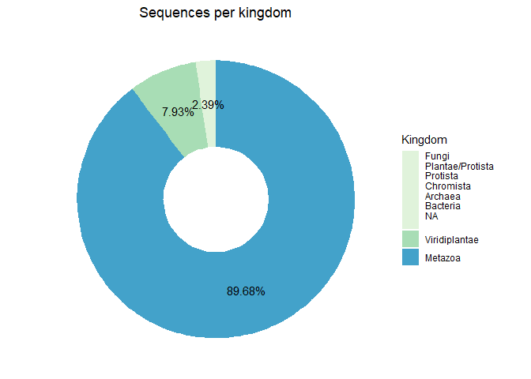
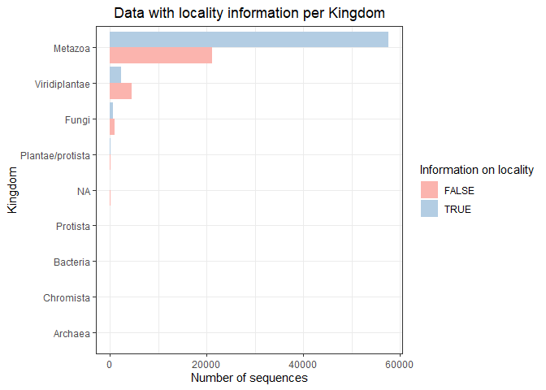
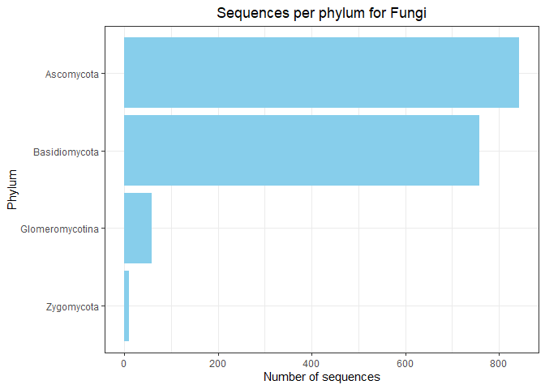

EDA BOLD DATA
================

Number of sequences per kingdom:

    ##            kingdom Number_sequences
    ## 1          Metazoa            78632
    ## 2    Viridiplantae             6955
    ## 3            Fungi             1670
    ## 4 Plantae/protista              229
    ## 5               NA               79
    ## 6         Protista               78
    ## 7         Bacteria               32
    ## 8        Chromista                5
    ## 9          Archaea                2

<!-- --><!-- -->

Information available for latitude and longitude:

    ## # A tibble: 18 x 3
    ## # Groups:   kingdom [9]
    ##    kingdom          latlon_info num_seqs
    ##    <chr>            <lgl>          <int>
    ##  1 Metazoa          FALSE           8559
    ##  2 Metazoa          TRUE           70073
    ##  3 Viridiplantae    FALSE           3401
    ##  4 Viridiplantae    TRUE            3554
    ##  5 Fungi            FALSE            860
    ##  6 Fungi            TRUE             810
    ##  7 Plantae/protista FALSE            160
    ##  8 Plantae/protista TRUE              69
    ##  9 NA               FALSE             64
    ## 10 NA               TRUE              15
    ## 11 Protista         FALSE             47
    ## 12 Protista         TRUE              31
    ## 13 Bacteria         FALSE             28
    ## 14 Bacteria         TRUE               4
    ## 15 Chromista        TRUE               5
    ## 16 Chromista        FALSE              0
    ## 17 Archaea          FALSE              1
    ## 18 Archaea          TRUE               1

<!-- -->

<!-- -->

Information available for locality:

    ## # A tibble: 18 x 4
    ## # Groups:   kingdom [9]
    ##    kingdom          locality_info num_seqs total$Number_sequences
    ##    <chr>            <lgl>            <int>                  <int>
    ##  1 Metazoa          FALSE            21069                  78632
    ##  2 Metazoa          TRUE             57563                  78632
    ##  3 Viridiplantae    FALSE             4587                   6955
    ##  4 Viridiplantae    TRUE              2368                   6955
    ##  5 Fungi            FALSE             1047                   1670
    ##  6 Fungi            TRUE               623                   1670
    ##  7 Plantae/protista FALSE               77                    229
    ##  8 Plantae/protista TRUE               152                    229
    ##  9 NA               FALSE               57                     79
    ## 10 NA               TRUE                22                     79
    ## 11 Protista         FALSE               26                     78
    ## 12 Protista         TRUE                52                     78
    ## 13 Bacteria         FALSE                7                     32
    ## 14 Bacteria         TRUE                25                     32
    ## 15 Chromista        FALSE                1                      5
    ## 16 Chromista        TRUE                 4                      5
    ## 17 Archaea          FALSE                1                      2
    ## 18 Archaea          TRUE                 1                      2

<!-- -->

<!-- -->

Sequences from kingdom Metazoa

    ## # A tibble: 12 x 2
    ## # Groups:   phylum [12]
    ##    phylum          num_seqs
    ##    <chr>              <int>
    ##  1 Arthropoda         60806
    ##  2 Chordata           15175
    ##  3 Mollusca             762
    ##  4 Annelida             651
    ##  5 Rotifera             468
    ##  6 Nematoda             268
    ##  7 Cnidaria             192
    ##  8 Echinodermata        176
    ##  9 Platyhelminthes       80
    ## 10 Acanthocephala        41
    ## 11 Porifera               9
    ## 12 Onychophora            4

<!-- -->

<!-- -->

Sequences from kingdom Viridiplantae

    ## # A tibble: 9 x 2
    ## # Groups:   phylum [9]
    ##   phylum           num_seqs
    ##   <chr>               <int>
    ## 1 Magnoliophyta        5996
    ## 2 Pinophyta             709
    ## 3 Pteridophyta           88
    ## 4 Cycadophyta            56
    ## 5 Marchantiophyta        39
    ## 6 Chlorophyta            33
    ## 7 Bryophyta              27
    ## 8 Anthocerotophyta        6
    ## 9 Streptophyta            1

<!-- -->

<!-- -->

    ## # A tibble: 4 x 2
    ## # Groups:   phylum [4]
    ##   phylum          num_seqs
    ##   <chr>              <int>
    ## 1 Ascomycota           843
    ## 2 Basidiomycota        759
    ## 3 Glomeromycotina       59
    ## 4 Zygomycota             9

``` r
phyl_fungi
```

<!-- -->

Sequences from kingdom Protista

    ## # A tibble: 7 x 3
    ## # Groups:   phylum [7]
    ##   phylum               kingdom          num_seqs
    ##   <chr>                <chr>               <int>
    ## 1 Rhodophyta           Plantae/protista      229
    ## 2 Heterokontophyta     Protista               46
    ## 3 Chlorarachniophyceae Protista               12
    ## 4 Bacillariophyta      Protista               10
    ## 5 Ciliophora           Protista                6
    ## 6 Pyrrophycophyta      Protista                3
    ## 7 Foraminifera         Protista                1

<!-- -->

Sequences from kingdom Archaea

    ## # A tibble: 1 x 3
    ## # Groups:   phylum [1]
    ##   phylum        kingdom num_seqs
    ##   <chr>         <chr>      <int>
    ## 1 Crenarchaeota Archaea        2
