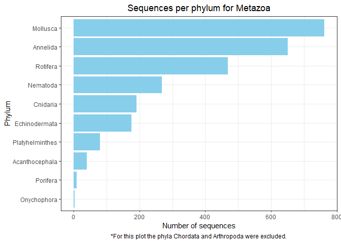

EDA BOLD DATA
================

Number of sequences per kingdom:

    ##            kingdom Number_sequences
    ## 1          Metazoa            78632
    ## 2    Viridiplantae             6955
    ## 3            Fungi             1670
    ## 4 Plantae/protista              229
    ## 5               NA               79
    ## 6         Protista               78
    ## 7         Bacteria               32
    ## 8        Chromista                5
    ## 9          Archaea                2

<!-- --><!-- -->

Information available for latitude and longitude:

    ## # A tibble: 18 x 3
    ## # Groups:   kingdom [9]
    ##    kingdom          latlon_info num_seqs
    ##    <chr>            <lgl>          <int>
    ##  1 Metazoa          FALSE           8559
    ##  2 Metazoa          TRUE           70073
    ##  3 Viridiplantae    FALSE           3401
    ##  4 Viridiplantae    TRUE            3554
    ##  5 Fungi            FALSE            860
    ##  6 Fungi            TRUE             810
    ##  7 Plantae/protista FALSE            160
    ##  8 Plantae/protista TRUE              69
    ##  9 NA               FALSE             64
    ## 10 NA               TRUE              15
    ## 11 Protista         FALSE             47
    ## 12 Protista         TRUE              31
    ## 13 Bacteria         FALSE             28
    ## 14 Bacteria         TRUE               4
    ## 15 Chromista        TRUE               5
    ## 16 Chromista        FALSE              0
    ## 17 Archaea          FALSE              1
    ## 18 Archaea          TRUE               1

<!-- -->

<!-- -->

Information available for locality:

    ## # A tibble: 18 x 3
    ## # Groups:   kingdom [9]
    ##    kingdom          locality_info num_seqs
    ##    <chr>            <lgl>            <int>
    ##  1 Metazoa          FALSE            21069
    ##  2 Metazoa          TRUE             57563
    ##  3 Viridiplantae    FALSE             4587
    ##  4 Viridiplantae    TRUE              2368
    ##  5 Fungi            FALSE             1047
    ##  6 Fungi            TRUE               623
    ##  7 Plantae/protista FALSE               77
    ##  8 Plantae/protista TRUE               152
    ##  9 NA               FALSE               57
    ## 10 NA               TRUE                22
    ## 11 Protista         FALSE               26
    ## 12 Protista         TRUE                52
    ## 13 Bacteria         FALSE                7
    ## 14 Bacteria         TRUE                25
    ## 15 Chromista        FALSE                1
    ## 16 Chromista        TRUE                 4
    ## 17 Archaea          FALSE                1
    ## 18 Archaea          TRUE                 1

<!-- -->

<!-- -->

Sequences from kingdom Metazoa

    ## # A tibble: 12 x 2
    ## # Groups:   phylum [12]
    ##    phylum          num_seqs
    ##    <chr>              <int>
    ##  1 Arthropoda         60806
    ##  2 Chordata           15175
    ##  3 Mollusca             762
    ##  4 Annelida             651
    ##  5 Rotifera             468
    ##  6 Nematoda             268
    ##  7 Cnidaria             192
    ##  8 Echinodermata        176
    ##  9 Platyhelminthes       80
    ## 10 Acanthocephala        41
    ## 11 Porifera               9
    ## 12 Onychophora            4

<!-- -->

<!-- -->

Sequences from kingdom Viridiplantae

    ## # A tibble: 9 x 2
    ## # Groups:   phylum [9]
    ##   phylum           num_seqs
    ##   <chr>               <int>
    ## 1 Magnoliophyta        5996
    ## 2 Pinophyta             709
    ## 3 Pteridophyta           88
    ## 4 Cycadophyta            56
    ## 5 Marchantiophyta        39
    ## 6 Chlorophyta            33
    ## 7 Bryophyta              27
    ## 8 Anthocerotophyta        6
    ## 9 Streptophyta            1

<!-- -->

<!-- -->

    ## # A tibble: 4 x 2
    ## # Groups:   phylum [4]
    ##   phylum          num_seqs
    ##   <chr>              <int>
    ## 1 Ascomycota           843
    ## 2 Basidiomycota        759
    ## 3 Glomeromycotina       59
    ## 4 Zygomycota             9

``` r
phyl_fungi
```

<!-- -->

Sequences from kingdom Protista

    ## # A tibble: 7 x 3
    ## # Groups:   phylum [7]
    ##   phylum               kingdom          num_seqs
    ##   <chr>                <chr>               <int>
    ## 1 Rhodophyta           Plantae/protista      229
    ## 2 Heterokontophyta     Protista               46
    ## 3 Chlorarachniophyceae Protista               12
    ## 4 Bacillariophyta      Protista               10
    ## 5 Ciliophora           Protista                6
    ## 6 Pyrrophycophyta      Protista                3
    ## 7 Foraminifera         Protista                1

<!-- -->

Sequences from kingdom Archaea

    ## # A tibble: 1 x 3
    ## # Groups:   phylum [1]
    ##   phylum        kingdom num_seqs
    ##   <chr>         <chr>      <int>
    ## 1 Crenarchaeota Archaea        2

Detailed analysis into phyla of interest: Metazoa: Chordata and
Arthropoda Viridiplantae: Magnoliophyta and Pinophyta Fungi: Ascomycota
and Basidiomycota

Analysis on genetic markers available for the selected organisms.

Number of sequences per marker for Metazoa

    ## # A tibble: 32 x 3
    ## # Groups:   Marker [21]
    ##    Marker    latlon_info Number_sequences
    ##    <chr>     <lgl>                  <int>
    ##  1 COI-5P    FALSE                   7595
    ##  2 COI-5P    TRUE                   58221
    ##  3 NA        FALSE                    368
    ##  4 NA        TRUE                    8882
    ##  5 28S-D2    FALSE                      4
    ##  6 28S-D2    TRUE                     316
    ##  7 CYTB      FALSE                     14
    ##  8 CYTB      TRUE                     138
    ##  9 28S-D2-D3 FALSE                      7
    ## 10 28S-D2-D3 TRUE                     132
    ## # ... with 22 more rows

    ## # A tibble: 32 x 3
    ## # Groups:   Marker [21]
    ##    Marker    locality_info Number_sequences
    ##    <chr>     <lgl>                    <int>
    ##  1 COI-5P    FALSE                    19980
    ##  2 COI-5P    TRUE                     45836
    ##  3 NA        FALSE                      138
    ##  4 NA        TRUE                      9112
    ##  5 28S-D2    FALSE                        4
    ##  6 28S-D2    TRUE                       316
    ##  7 CYTB      FALSE                        8
    ##  8 CYTB      TRUE                       144
    ##  9 28S-D2-D3 TRUE                       139
    ## 10 COI-3P    FALSE                        4
    ## # ... with 22 more rows

<!-- --><!-- --><!-- -->

Number of sequences per marker for Viridiplantae

    ## # A tibble: 18 x 3
    ## # Groups:   Marker [10]
    ##    Marker         latlon_info Number_sequences
    ##    <chr>          <lgl>                  <int>
    ##  1 matK           FALSE                   1125
    ##  2 matK           TRUE                    1295
    ##  3 rbcLa          FALSE                    142
    ##  4 rbcLa          TRUE                    1704
    ##  5 ITS2           FALSE                   1675
    ##  6 ITS2           TRUE                     125
    ##  7 rbcL           FALSE                    200
    ##  8 rbcL           TRUE                     126
    ##  9 trnD-trnY-trnE FALSE                      9
    ## 10 trnD-trnY-trnE TRUE                      93
    ## 11 trnH-psbA      FALSE                      9
    ## 12 trnH-psbA      TRUE                      93
    ## 13 ycf1           FALSE                      9
    ## 14 ycf1           TRUE                      93
    ## 15 NA             FALSE                      1
    ## 16 NA             TRUE                       4
    ## 17 ITS            TRUE                       1
    ## 18 trnL-F         FALSE                      1

    ## # A tibble: 18 x 3
    ## # Groups:   Marker [10]
    ##    Marker         locality_info Number_sequences
    ##    <chr>          <lgl>                    <int>
    ##  1 matK           FALSE                     2011
    ##  2 matK           TRUE                       409
    ##  3 rbcLa          FALSE                     1623
    ##  4 rbcLa          TRUE                       223
    ##  5 ITS2           FALSE                      563
    ##  6 ITS2           TRUE                      1237
    ##  7 rbcL           FALSE                      173
    ##  8 rbcL           TRUE                       153
    ##  9 trnD-trnY-trnE FALSE                        2
    ## 10 trnD-trnY-trnE TRUE                       100
    ## 11 trnH-psbA      FALSE                        2
    ## 12 trnH-psbA      TRUE                       100
    ## 13 ycf1           FALSE                        2
    ## 14 ycf1           TRUE                       100
    ## 15 NA             FALSE                        2
    ## 16 NA             TRUE                         3
    ## 17 ITS            TRUE                         1
    ## 18 trnL-F         FALSE                        1

<!-- --><!-- --><!-- -->

Number of sequences per marker for Fungi

    ## # A tibble: 12 x 3
    ## # Groups:   Marker [6]
    ##    Marker latlon_info Number_sequences
    ##    <chr>  <lgl>                  <dbl>
    ##  1 ITS    FALSE                    786
    ##  2 ITS    TRUE                     632
    ##  3 ITS2   TRUE                      59
    ##  4 ITS2   FALSE                      0
    ##  5 ITS1   TRUE                      59
    ##  6 ITS1   FALSE                      0
    ##  7 5.8S   TRUE                      59
    ##  8 5.8S   FALSE                      0
    ##  9 NA     FALSE                      1
    ## 10 NA     TRUE                       0
    ## 11 28S    FALSE                      1
    ## 12 28S    TRUE                       0

    ##    Marker locality_info Number_sequences
    ## 1     ITS         FALSE             1018
    ## 2     ITS          TRUE              400
    ## 3    ITS2         FALSE                6
    ## 4    ITS2          TRUE               53
    ## 5    ITS1         FALSE                6
    ## 6    ITS1          TRUE               53
    ## 7    5.8S         FALSE                6
    ## 8    5.8S          TRUE               53
    ## 9      NA         FALSE                0
    ## 10     NA          TRUE                1
    ## 11    28S         FALSE                0
    ## 12    28S          TRUE                1

<!-- --><!-- --><!-- -->
