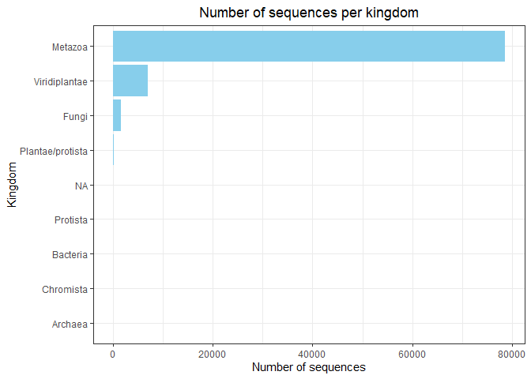
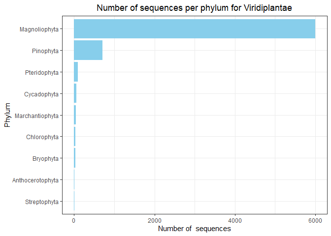

EDA BOLD DATA
================

Number of sequences per kingdom:

    ##            kingdom   n()
    ## 1          Archaea     2
    ## 2         Bacteria    32
    ## 3        Chromista     5
    ## 4            Fungi  1670
    ## 5          Metazoa 78636
    ## 6 Plantae/protista   229
    ## 7         Protista   153
    ## 8    Viridiplantae  6955

<!-- --><!-- --><!-- -->

Information available for latitude and longitude:

    ## # A tibble: 16 x 3
    ## # Groups:   kingdom [8]
    ##    kingdom          latlon_info num_seqs
    ##    <chr>            <lgl>          <int>
    ##  1 Archaea          FALSE              1
    ##  2 Archaea          TRUE               1
    ##  3 Bacteria         FALSE             28
    ##  4 Bacteria         TRUE               4
    ##  5 Chromista        TRUE               5
    ##  6 Chromista        FALSE              0
    ##  7 Fungi            FALSE            860
    ##  8 Fungi            TRUE             810
    ##  9 Metazoa          FALSE           8559
    ## 10 Metazoa          TRUE           70077
    ## 11 Plantae/protista FALSE            160
    ## 12 Plantae/protista TRUE              69
    ## 13 Protista         FALSE            111
    ## 14 Protista         TRUE              42
    ## 15 Viridiplantae    FALSE           3401
    ## 16 Viridiplantae    TRUE            3554

<!-- -->

<!-- -->

Information available for locality:

    ## # A tibble: 16 x 3
    ## # Groups:   kingdom [8]
    ##    kingdom          locality_info num_seqs
    ##    <chr>            <lgl>            <int>
    ##  1 Archaea          FALSE                1
    ##  2 Archaea          TRUE                 1
    ##  3 Bacteria         FALSE                7
    ##  4 Bacteria         TRUE                25
    ##  5 Chromista        FALSE                1
    ##  6 Chromista        TRUE                 4
    ##  7 Fungi            FALSE             1047
    ##  8 Fungi            TRUE               623
    ##  9 Metazoa          FALSE            21069
    ## 10 Metazoa          TRUE             57567
    ## 11 Plantae/protista FALSE               77
    ## 12 Plantae/protista TRUE               152
    ## 13 Protista         FALSE               83
    ## 14 Protista         TRUE                70
    ## 15 Viridiplantae    FALSE             4587
    ## 16 Viridiplantae    TRUE              2368

<!-- -->

<!-- -->

Sequences from kingdom Metazoa

    ## # A tibble: 13 x 2
    ## # Groups:   phylum [13]
    ##    phylum          num_seqs
    ##    <chr>              <int>
    ##  1 Arthropoda         60806
    ##  2 Chordata           15175
    ##  3 Mollusca             762
    ##  4 Annelida             651
    ##  5 Rotifera             468
    ##  6 Nematoda             268
    ##  7 Cnidaria             192
    ##  8 Echinodermata        176
    ##  9 Platyhelminthes       80
    ## 10 Acanthocephala        41
    ## 11 Porifera               9
    ## 12 Onychophora            4
    ## 13 Phoronida              4

<!-- -->

<!-- -->

Sequences from kingdom Viridiplantae

    ## # A tibble: 9 x 2
    ## # Groups:   phylum [9]
    ##   phylum           num_seqs
    ##   <chr>               <int>
    ## 1 Magnoliophyta        5996
    ## 2 Pinophyta             709
    ## 3 Pteridophyta           88
    ## 4 Cycadophyta            56
    ## 5 Marchantiophyta        39
    ## 6 Chlorophyta            33
    ## 7 Bryophyta              27
    ## 8 Anthocerotophyta        6
    ## 9 Streptophyta            1

<!-- -->

<!-- -->

    ## # A tibble: 4 x 2
    ## # Groups:   phylum [4]
    ##   phylum          num_seqs
    ##   <chr>              <int>
    ## 1 Ascomycota           843
    ## 2 Basidiomycota        759
    ## 3 Glomeromycotina       59
    ## 4 Zygomycota             9

``` r
phyl_fungi
```

<!-- -->

Sequences from kingdom Protista

    ## # A tibble: 8 x 3
    ## # Groups:   phylum [8]
    ##   phylum               kingdom          num_seqs
    ##   <chr>                <chr>               <int>
    ## 1 Rhodophyta           Plantae/protista      229
    ## 2 Ochrophyta           Protista               75
    ## 3 Heterokontophyta     Protista               46
    ## 4 Chlorarachniophyceae Protista               12
    ## 5 Bacillariophyta      Protista               10
    ## 6 Ciliophora           Protista                6
    ## 7 Pyrrophycophyta      Protista                3
    ## 8 Foraminifera         Protista                1

<!-- -->

Sequences from kingdom Archaea

    ## # A tibble: 1 x 3
    ## # Groups:   phylum [1]
    ##   phylum        kingdom num_seqs
    ##   <chr>         <chr>      <int>
    ## 1 Crenarchaeota Archaea        2
