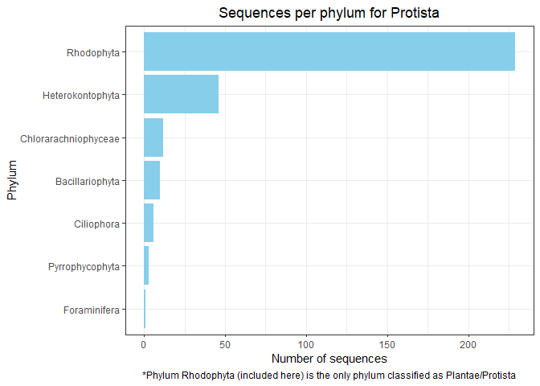
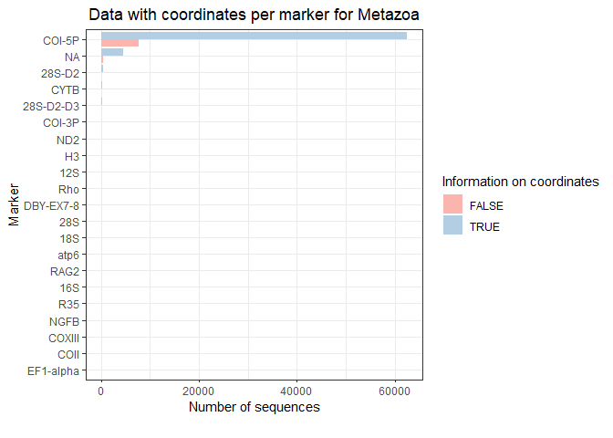
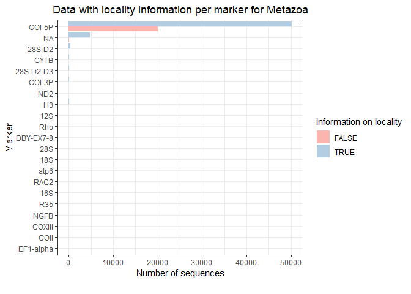

EDA BOLD DATA
================

Number of sequences per kingdom:

    ##            kingdom Number_sequences
    ## 1          Metazoa            78632
    ## 2    Viridiplantae             6955
    ## 3            Fungi             1670
    ## 4 Plantae/protista              229
    ## 5               NA               79
    ## 6         Protista               78
    ## 7         Bacteria               32
    ## 8        Chromista                5
    ## 9          Archaea                2

<!-- --><!-- -->

Information available for latitude and longitude:

    ## # A tibble: 18 x 3
    ## # Groups:   kingdom [9]
    ##    kingdom          latlon_info num_seqs
    ##    <chr>            <lgl>          <int>
    ##  1 Metazoa          FALSE           8559
    ##  2 Metazoa          TRUE           70073
    ##  3 Viridiplantae    FALSE           3401
    ##  4 Viridiplantae    TRUE            3554
    ##  5 Fungi            FALSE            860
    ##  6 Fungi            TRUE             810
    ##  7 Plantae/protista FALSE            160
    ##  8 Plantae/protista TRUE              69
    ##  9 NA               FALSE             64
    ## 10 NA               TRUE              15
    ## 11 Protista         FALSE             47
    ## 12 Protista         TRUE              31
    ## 13 Bacteria         FALSE             28
    ## 14 Bacteria         TRUE               4
    ## 15 Chromista        TRUE               5
    ## 16 Chromista        FALSE              0
    ## 17 Archaea          FALSE              1
    ## 18 Archaea          TRUE               1

<!-- -->

<!-- -->

Information available for locality:

    ## # A tibble: 18 x 3
    ## # Groups:   kingdom [9]
    ##    kingdom          locality_info num_seqs
    ##    <chr>            <lgl>            <int>
    ##  1 Metazoa          FALSE            21069
    ##  2 Metazoa          TRUE             57563
    ##  3 Viridiplantae    FALSE             4587
    ##  4 Viridiplantae    TRUE              2368
    ##  5 Fungi            FALSE             1047
    ##  6 Fungi            TRUE               623
    ##  7 Plantae/protista FALSE               77
    ##  8 Plantae/protista TRUE               152
    ##  9 NA               FALSE               57
    ## 10 NA               TRUE                22
    ## 11 Protista         FALSE               26
    ## 12 Protista         TRUE                52
    ## 13 Bacteria         FALSE                7
    ## 14 Bacteria         TRUE                25
    ## 15 Chromista        FALSE                1
    ## 16 Chromista        TRUE                 4
    ## 17 Archaea          FALSE                1
    ## 18 Archaea          TRUE                 1

<!-- -->

<!-- -->

Sequences from kingdom Metazoa

    ## # A tibble: 12 x 2
    ## # Groups:   phylum [12]
    ##    phylum          num_seqs
    ##    <chr>              <int>
    ##  1 Arthropoda         60806
    ##  2 Chordata           15175
    ##  3 Mollusca             762
    ##  4 Annelida             651
    ##  5 Rotifera             468
    ##  6 Nematoda             268
    ##  7 Cnidaria             192
    ##  8 Echinodermata        176
    ##  9 Platyhelminthes       80
    ## 10 Acanthocephala        41
    ## 11 Porifera               9
    ## 12 Onychophora            4

<!-- -->

<!-- -->

Sequences from kingdom Viridiplantae

    ## # A tibble: 9 x 2
    ## # Groups:   phylum [9]
    ##   phylum           num_seqs
    ##   <chr>               <int>
    ## 1 Magnoliophyta        5996
    ## 2 Pinophyta             709
    ## 3 Pteridophyta           88
    ## 4 Cycadophyta            56
    ## 5 Marchantiophyta        39
    ## 6 Chlorophyta            33
    ## 7 Bryophyta              27
    ## 8 Anthocerotophyta        6
    ## 9 Streptophyta            1

<!-- -->

<!-- -->

    ## # A tibble: 4 x 2
    ## # Groups:   phylum [4]
    ##   phylum          num_seqs
    ##   <chr>              <int>
    ## 1 Ascomycota           843
    ## 2 Basidiomycota        759
    ## 3 Glomeromycotina       59
    ## 4 Zygomycota             9

``` r
phyl_fungi
```

<!-- -->

Sequences from kingdom Protista

    ## # A tibble: 7 x 3
    ## # Groups:   phylum [7]
    ##   phylum               kingdom          num_seqs
    ##   <chr>                <chr>               <int>
    ## 1 Rhodophyta           Plantae/protista      229
    ## 2 Heterokontophyta     Protista               46
    ## 3 Chlorarachniophyceae Protista               12
    ## 4 Bacillariophyta      Protista               10
    ## 5 Ciliophora           Protista                6
    ## 6 Pyrrophycophyta      Protista                3
    ## 7 Foraminifera         Protista                1

<!-- -->

Sequences from kingdom Archaea

    ## # A tibble: 1 x 3
    ## # Groups:   phylum [1]
    ##   phylum        kingdom num_seqs
    ##   <chr>         <chr>      <int>
    ## 1 Crenarchaeota Archaea        2

Detailed analysis into phyla of interest:

Metazoa: Chordata and Arthropoda

Viridiplantae: Magnoliophyta and Pinophyta

Fungi: Ascomycota and Basidiomycota

Analysis on genetic markers available for the selected organisms.

Genetic markers available for all organisms:

    ## # A tibble: 32 x 2
    ##    marker         `n()`
    ##    <chr>          <int>
    ##  1 COI-5P         70181
    ##  2 <NA>            4877
    ##  3 matK            2423
    ##  4 ITS2            1859
    ##  5 rbcLa           1846
    ##  6 ITS             1419
    ##  7 28S-D2           326
    ##  8 rbcL             326
    ##  9 CYTB             153
    ## 10 28S-D2-D3        139
    ## 11 trnD-trnY-trnE   102
    ## 12 trnH-psbA        102
    ## 13 ycf1             102
    ## 14 COI-3P            94
    ## 15 5.8S              59
    ## 16 ITS1              59
    ## 17 ND2               42
    ## 18 H3                37
    ## 19 12S               31
    ## 20 Rho               19
    ## 21 28S               15
    ## 22 DBY-EX7-8         14
    ## 23 18S               12
    ## 24 atp6               6
    ## 25 16S                5
    ## 26 RAG2               5
    ## 27 NGFB               3
    ## 28 R35                3
    ## 29 COII               2
    ## 30 COXIII             2
    ## 31 EF1-alpha          1
    ## 32 trnL-F             1

Number of sequences per marker for Metazoa

    ## # A tibble: 21 x 2
    ##    Marker    Number_sequences
    ##    <chr>                <int>
    ##  1 COI-5P               70181
    ##  2 NA                    4874
    ##  3 28S-D2                 326
    ##  4 CYTB                   153
    ##  5 28S-D2-D3              139
    ##  6 COI-3P                  94
    ##  7 ND2                     42
    ##  8 H3                      37
    ##  9 12S                     31
    ## 10 Rho                     19
    ## 11 28S                     14
    ## 12 DBY-EX7-8               14
    ## 13 18S                     12
    ## 14 atp6                     6
    ## 15 16S                      5
    ## 16 RAG2                     5
    ## 17 NGFB                     3
    ## 18 R35                      3
    ## 19 COII                     2
    ## 20 COXIII                   2
    ## 21 EF1-alpha                1

    ##       Marker latlon_info Number_sequences
    ## 1     COI-5P        TRUE            62547
    ## 2     COI-5P       FALSE             7634
    ## 3         NA        TRUE             4546
    ## 4         NA       FALSE              328
    ## 5     28S-D2        TRUE              322
    ## 6     28S-D2       FALSE                4
    ## 7       CYTB        TRUE              139
    ## 8       CYTB       FALSE               14
    ## 9  28S-D2-D3        TRUE              132
    ## 10 28S-D2-D3       FALSE                7
    ## 11    COI-3P        TRUE                2
    ## 12    COI-3P       FALSE               92
    ## 13       ND2        TRUE               42
    ## 14       ND2       FALSE                0
    ## 15        H3        TRUE               29
    ## 16        H3       FALSE                8
    ## 17       12S        TRUE               31
    ## 18       12S       FALSE                0
    ## 19       Rho        TRUE                0
    ## 20       Rho       FALSE               19
    ## 21 DBY-EX7-8        TRUE               13
    ## 22 DBY-EX7-8       FALSE                1
    ## 23       28S        TRUE               12
    ## 24       28S       FALSE                2
    ## 25       18S        TRUE                6
    ## 26       18S       FALSE                6
    ## 27      atp6        TRUE                0
    ## 28      atp6       FALSE                6
    ## 29      RAG2        TRUE                5
    ## 30      RAG2       FALSE                0
    ## 31       16S        TRUE                4
    ## 32       16S       FALSE                1
    ## 33       R35        TRUE                3
    ## 34       R35       FALSE                0
    ## 35      NGFB        TRUE                3
    ## 36      NGFB       FALSE                0
    ## 37    COXIII        TRUE                0
    ## 38    COXIII       FALSE                2
    ## 39      COII        TRUE                0
    ## 40      COII       FALSE                2
    ## 41 EF1-alpha        TRUE                1
    ## 42 EF1-alpha       FALSE                0

    ##       Marker locality_info Number_sequences
    ## 1     COI-5P          TRUE            50144
    ## 2     COI-5P         FALSE            20037
    ## 3         NA          TRUE             4793
    ## 4         NA         FALSE               81
    ## 5     28S-D2          TRUE              322
    ## 6     28S-D2         FALSE                4
    ## 7       CYTB          TRUE              145
    ## 8       CYTB         FALSE                8
    ## 9  28S-D2-D3          TRUE              139
    ## 10 28S-D2-D3         FALSE                0
    ## 11    COI-3P          TRUE               90
    ## 12    COI-3P         FALSE                4
    ## 13       ND2          TRUE               31
    ## 14       ND2         FALSE               11
    ## 15        H3          TRUE               37
    ## 16        H3         FALSE                0
    ## 17       12S          TRUE                0
    ## 18       12S         FALSE               31
    ## 19       Rho          TRUE               18
    ## 20       Rho         FALSE                1
    ## 21 DBY-EX7-8          TRUE               14
    ## 22 DBY-EX7-8         FALSE                0
    ## 23       28S          TRUE                9
    ## 24       28S         FALSE                5
    ## 25       18S          TRUE                3
    ## 26       18S         FALSE                9
    ## 27      atp6          TRUE                4
    ## 28      atp6         FALSE                2
    ## 29      RAG2          TRUE                3
    ## 30      RAG2         FALSE                2
    ## 31       16S          TRUE                0
    ## 32       16S         FALSE                5
    ## 33       R35          TRUE                3
    ## 34       R35         FALSE                0
    ## 35      NGFB          TRUE                3
    ## 36      NGFB         FALSE                0
    ## 37    COXIII          TRUE                0
    ## 38    COXIII         FALSE                2
    ## 39      COII          TRUE                0
    ## 40      COII         FALSE                2
    ## 41 EF1-alpha          TRUE                1
    ## 42 EF1-alpha         FALSE                0

<!-- --><!-- --><!-- -->

Number of sequences per marker for Viridiplantae

    ##            Marker latlon_info Number_sequences
    ## 1            matK        TRUE             1298
    ## 2            matK       FALSE             1125
    ## 3           rbcLa        TRUE             1704
    ## 4           rbcLa       FALSE              142
    ## 5            ITS2        TRUE              125
    ## 6            ITS2       FALSE             1675
    ## 7            rbcL        TRUE              126
    ## 8            rbcL       FALSE              200
    ## 9            ycf1        TRUE               93
    ## 10           ycf1       FALSE                9
    ## 11      trnH-psbA        TRUE               93
    ## 12      trnH-psbA       FALSE                9
    ## 13 trnD-trnY-trnE        TRUE               93
    ## 14 trnD-trnY-trnE       FALSE                9
    ## 15             NA        TRUE                1
    ## 16             NA       FALSE                1
    ## 17         trnL-F        TRUE                0
    ## 18         trnL-F       FALSE                1
    ## 19            ITS        TRUE                1
    ## 20            ITS       FALSE                0

    ##            Marker locality_info Number_sequences
    ## 1            matK          TRUE              411
    ## 2            matK         FALSE             2012
    ## 3           rbcLa          TRUE              223
    ## 4           rbcLa         FALSE             1623
    ## 5            ITS2          TRUE             1237
    ## 6            ITS2         FALSE              563
    ## 7            rbcL          TRUE              153
    ## 8            rbcL         FALSE              173
    ## 9            ycf1          TRUE              100
    ## 10           ycf1         FALSE                2
    ## 11      trnH-psbA          TRUE              100
    ## 12      trnH-psbA         FALSE                2
    ## 13 trnD-trnY-trnE          TRUE              100
    ## 14 trnD-trnY-trnE         FALSE                2
    ## 15             NA          TRUE                1
    ## 16             NA         FALSE                1
    ## 17         trnL-F          TRUE                0
    ## 18         trnL-F         FALSE                1
    ## 19            ITS          TRUE                1
    ## 20            ITS         FALSE                0

<!-- --><!-- --><!-- -->

Number of sequences per marker for Fungi

    ## # A tibble: 12 x 3
    ## # Groups:   Marker [6]
    ##    Marker latlon_info Number_sequences
    ##    <chr>  <lgl>                  <dbl>
    ##  1 ITS    FALSE                    786
    ##  2 ITS    TRUE                     632
    ##  3 ITS2   TRUE                      59
    ##  4 ITS2   FALSE                      0
    ##  5 ITS1   TRUE                      59
    ##  6 ITS1   FALSE                      0
    ##  7 5.8S   TRUE                      59
    ##  8 5.8S   FALSE                      0
    ##  9 NA     FALSE                      1
    ## 10 NA     TRUE                       0
    ## 11 28S    FALSE                      1
    ## 12 28S    TRUE                       0

    ##    Marker locality_info Number_sequences
    ## 1     ITS         FALSE             1018
    ## 2     ITS          TRUE              400
    ## 3    ITS2         FALSE                6
    ## 4    ITS2          TRUE               53
    ## 5    ITS1         FALSE                6
    ## 6    ITS1          TRUE               53
    ## 7    5.8S         FALSE                6
    ## 8    5.8S          TRUE               53
    ## 9      NA         FALSE                0
    ## 10     NA          TRUE                1
    ## 11    28S         FALSE                0
    ## 12    28S          TRUE                1

<!-- --><!-- --><!-- -->
