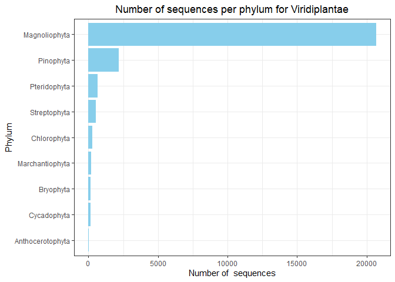
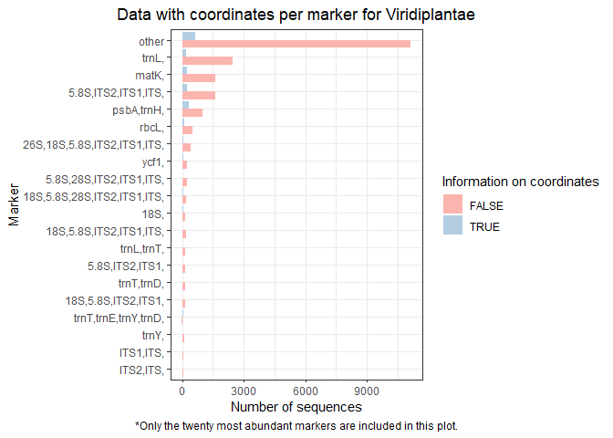

EDA GENBANK DATA
================

Number of sequences per kingdom:

    ##            Kingdom Number_sequences
    ## 1          Metazoa           211502
    ## 2               NA           126342
    ## 3            Fungi            31295
    ## 4    Viridiplantae            24846
    ## 5            Virus             6533
    ## 6          Archaea             4883
    ## 7         Protista             3017
    ## 8 Plantae/Protista              670
    ## 9        Chromista                3

<!-- --><!-- -->

Information available for latitude and longitude:

    ## # A tibble: 18 x 3
    ## # Groups:   kingdom [9]
    ##    kingdom          latlon_info num_seqs
    ##    <chr>            <lgl>          <int>
    ##  1 Metazoa          FALSE         194791
    ##  2 Metazoa          TRUE           16711
    ##  3 NA               FALSE          11812
    ##  4 NA               TRUE          114530
    ##  5 Fungi            FALSE          27153
    ##  6 Fungi            TRUE            4142
    ##  7 Viridiplantae    FALSE          22604
    ##  8 Viridiplantae    TRUE            2242
    ##  9 Virus            FALSE           6456
    ## 10 Virus            TRUE              77
    ## 11 Archaea          FALSE           2929
    ## 12 Archaea          TRUE            1954
    ## 13 Protista         FALSE           2279
    ## 14 Protista         TRUE             738
    ## 15 Plantae/Protista FALSE            553
    ## 16 Plantae/Protista TRUE             117
    ## 17 Chromista        FALSE              3
    ## 18 Chromista        TRUE               0

<!-- -->

<!-- -->

Information available for locality:

    ## # A tibble: 18 x 3
    ## # Groups:   kingdom [9]
    ##    kingdom          locality_info num_seqs
    ##    <chr>            <lgl>            <int>
    ##  1 Metazoa          FALSE            25012
    ##  2 Metazoa          TRUE            186490
    ##  3 NA               FALSE           121906
    ##  4 NA               TRUE              4436
    ##  5 Fungi            FALSE            14544
    ##  6 Fungi            TRUE             16751
    ##  7 Viridiplantae    FALSE            16285
    ##  8 Viridiplantae    TRUE              8561
    ##  9 Virus            FALSE             5438
    ## 10 Virus            TRUE              1095
    ## 11 Archaea          FALSE             2085
    ## 12 Archaea          TRUE              2798
    ## 13 Protista         FALSE             2709
    ## 14 Protista         TRUE               308
    ## 15 Plantae/Protista FALSE              161
    ## 16 Plantae/Protista TRUE               509
    ## 17 Chromista        FALSE                3
    ## 18 Chromista        TRUE                 0

<!-- -->

<!-- -->

Sequences from kingdom Metazoa

    ## # A tibble: 18 x 2
    ## # Groups:   phylum [18]
    ##    phylum          num_seqs
    ##    <chr>              <int>
    ##  1 Arthropoda        172402
    ##  2 Chordata           33054
    ##  3 Mollusca            2244
    ##  4 Platyhelminthes     1322
    ##  5 Nematoda             834
    ##  6 Cnidaria             411
    ##  7 Rotifera             404
    ##  8 Annelida             327
    ##  9 Echinodermata        307
    ## 10 Acanthocephala       111
    ## 11 Porifera              36
    ## 12 Ctenophora            16
    ## 13 Xenacoelomorpha       14
    ## 14 Nemertea              11
    ## 15 Gastrotricha           3
    ## 16 Nematomorpha           3
    ## 17 Bryozoa                2
    ## 18 NA                     1

<!-- -->

<!-- -->

Sequences from kingdom Viridiplantae

    ## # A tibble: 9 x 2
    ## # Groups:   phylum [9]
    ##   phylum           num_seqs
    ##   <chr>               <int>
    ## 1 Magnoliophyta       20676
    ## 2 Pinophyta            2176
    ## 3 Pteridophyta          655
    ## 4 Streptophyta          530
    ## 5 Chlorophyta           287
    ## 6 Marchantiophyta       191
    ## 7 Bryophyta             147
    ## 8 Cycadophyta           144
    ## 9 Anthocerotophyta       40

<!-- -->

<!-- -->

    ## # A tibble: 12 x 2
    ## # Groups:   phylum [12]
    ##    phylum             num_seqs
    ##    <chr>                 <int>
    ##  1 Ascomycota            22980
    ##  2 Basidiomycota          5975
    ##  3 Glomeromycotina        1945
    ##  4 NA                      224
    ##  5 Zygomycota              100
    ##  6 Mucoromycota             43
    ##  7 Chytridiomycota           8
    ##  8 Microsporidia             7
    ##  9 Blastocladiomycota        5
    ## 10 Cryptomycota              4
    ## 11 Olpidiomycota             3
    ## 12 Zoopagomycota             1

``` r
phyl_fungi
```

<!-- -->

``` r
phyl_fungi2
```

<!-- -->

Sequences from kingdom Archaea

    ## # A tibble: 5 x 3
    ## # Groups:   phylum [5]
    ##   phylum                    kingdom num_seqs
    ##   <chr>                     <chr>      <int>
    ## 1 Crenarchaeota             Archaea     2350
    ## 2 Euryarchaeota             Archaea     1793
    ## 3 Candidatus Bathyarchaeota Archaea      576
    ## 4 Thaumarchaeota            Archaea      158
    ## 5 Candidatus Micrarchaeota  Archaea        6

<!-- -->

Sequences from kingdom Protista

    ## # A tibble: 15 x 3
    ## # Groups:   phylum [15]
    ##    phylum               kingdom          num_seqs
    ##    <chr>                <chr>               <int>
    ##  1 Heterokontophyta     Protista             1149
    ##  2 Apicomplexa          Protista              979
    ##  3 Rhodophyta           Plantae/Protista      670
    ##  4 Pyrrophycophyta      Protista              380
    ##  5 Ciliophora           Protista              242
    ##  6 Protista             Protista              119
    ##  7 Bacillariophyta      Protista               62
    ##  8 Ochrophyta           Protista               39
    ##  9 Perkinsozoa          Protista               14
    ## 10 Chlorarachniophyceae Protista               12
    ## 11 Haptophyta           Protista                6
    ## 12 Heterolobosea        Protista                6
    ## 13 Cercozoa             Protista                4
    ## 14 Choanozoa            Protista                4
    ## 15 Euglenida            Protista                1

<!-- -->

Sequences from kingdom Virus.

    ## # A tibble: 2 x 3
    ## # Groups:   phylum [2]
    ##   phylum          kingdom num_seqs
    ##   <chr>           <chr>      <int>
    ## 1 Negarnaviricota Virus       5692
    ## 2 Virus           Virus        841

<!-- -->

The phyla with the largest number of sequences were chosen from
kingdoms: Metazoa, Viridiplantae and Fungi.

Metazoa: 1)Chordata 2)Arthropoda

Viridiplantae: 1)Magnoliophyta  
2)Pinophyta

Fungi: 1)Basidiomycota 2)Ascomycota

Genetic markers available for all organisms:

The following analysis were made after excluding all the records that
did not have any type of genetic sequence available.

For the data retrieved from Genbank, some of the sequences retrieved
span more than one genetic marker, this was annotated accordingly in the
database and is reflected on the marker column.

    ## # A tibble: 96 x 2
    ##    Marker                                      Number_sequences
    ##    <chr>                                                  <int>
    ##  1 other                                                 197753
    ##  2 COI,                                                   16145
    ##  3 CYTB,                                                   5062
    ##  4 5.8S,ITS2,ITS1,ITS,                                     4267
    ##  5 trnL,                                                   2717
    ##  6 18S,5.8S,28S,ITS2,ITS1,ITS,                             2568
    ##  7 16S,                                                    2011
    ##  8 matK,                                                   1884
    ##  9 28S,                                                    1619
    ## 10 psbA,trnH,                                              1328
    ## 11 5.8S,28S,ITS2,ITS1,ITS,                                 1266
    ## 12 18S,                                                     862
    ## 13 18S,5.8S,ITS2,ITS1,ITS,                                  850
    ## 14 26S,                                                     768
    ## 15 Rho,                                                     659
    ## 16 rbcL,                                                    629
    ## 17 26S,18S,5.8S,ITS2,ITS1,ITS,                              489
    ## 18 18S,ITS1,ITS,                                            406
    ## 19 5.8S,28S,ITS2,ITS,                                       397
    ## 20 ycf1,                                                    315
    ## 21 trnT,                                                    269
    ## 22 ITS2,ITS,                                                260
    ## 23 trnH,                                                    204
    ## 24 5.8S,ITS2,ITS1,                                          166
    ## 25 5.8S,ITS2,ITS,                                           164
    ## 26 trnL,trnT,                                               161
    ## 27 trnT,trnD,                                               145
    ## 28 18S,5.8S,ITS2,ITS1,                                      143
    ## 29 ITS1,ITS,                                                124
    ## 30 trnT,trnE,trnY,trnD,                                      99
    ## 31 18S,5.8S,28S,ITS2,ITS1,                                   88
    ## 32 5.8S,ITS1,ITS,                                            86
    ## 33 trnY,                                                     86
    ## 34 18S,5.8S,ITS1,ITS,                                        68
    ## 35 5.8S,28S,ITS2,                                            63
    ## 36 ITS1,                                                     57
    ## 37 18S,28S,                                                  47
    ## 38 26S,18S,                                                  46
    ## 39 ITS,                                                      45
    ## 40 ITS2,                                                     45
    ## 41 trnT,trnE,trnY,                                           45
    ## 42 trnE,trnY,trnD,                                           40
    ## 43 26S,18S,5.8S,ITS2,ITS1,                                   37
    ## 44 psbA,matK,                                                37
    ## 45 26S,5.8S,ITS2,ITS1,ITS,                                   33
    ## 46 26S,5.8S,ITS2,ITS1,                                       32
    ## 47 16S,trnL,                                                 26
    ## 48 trnE,trnY,                                                24
    ## 49 Rho,COI,                                                  21
    ## 50 5.8S,28S,ITS2,ITS1,                                       18
    ## 51 trnT,CYTB,                                                17
    ## 52 26S,Rho,                                                  13
    ## 53 Rho,5.8S,28S,ITS2,ITS1,ITS,                               11
    ## 54 26S,18S,5.8S,ITS2,ITS,                                     9
    ## 55 16S,trnL,trnT,trnH,trnE,trnY,trnD,CYTB,COI,                8
    ## 56 28S,ITS2,ITS,                                              8
    ## 57 trnL,trnH,                                                 6
    ## 58 18S,5.8S,28S,                                              5
    ## 59 5.8S,                                                      5
    ## 60 Rho,5.8S,ITS2,ITS1,ITS,                                    5
    ## 61 trnD,                                                      5
    ## 62 16S,CYTB,                                                  4
    ## 63 18S,5.8S,ITS2,ITS,                                         4
    ## 64 Rho,18S,5.8S,28S,ITS2,ITS1,ITS,                            4
    ## 65 trnL,matK,                                                 4
    ## 66 16S,CYTB,COI,                                              3
    ## 67 26S,5.8S,ITS1,ITS,                                         3
    ## 68 26S,COI,                                                   3
    ## 69 5.8S,28S,ITS1,ITS,                                         3
    ## 70 5.8S,ITS,                                                  3
    ## 71 ITS2,ITS1,ITS,                                             3
    ## 72 Rho,16S,                                                   3
    ## 73 Rho,18S,5.8S,ITS2,ITS1,ITS,                                3
    ## 74 Rho,5.8S,                                                  3
    ## 75 18S,28S,ITS2,ITS1,ITS,                                     2
    ## 76 5.8S,COI,                                                  2
    ## 77 5.8S,CYTB,                                                 2
    ## 78 psbA,                                                      2
    ## 79 Rho,5.8S,ITS1,ITS,                                         2
    ## 80 trnL,COI,                                                  2
    ## 81 16S,18S,                                                   1
    ## 82 16S,COI,                                                   1
    ## 83 16S,ITS2,ITS1,                                             1
    ## 84 18S,5.8S,28S,ITS2,ITS,                                     1
    ## 85 18S,COI,                                                   1
    ## 86 18S,CYTB,                                                  1
    ## 87 18S,ITS1,                                                  1
    ## 88 26S,16S,                                                   1
    ## 89 26S,5.8S,ITS2,ITS,                                         1
    ## 90 26S,CYTB,                                                  1
    ## 91 28S,ITS2,ITS1,ITS,                                         1
    ## 92 Rho,18S,                                                   1
    ## 93 Rho,CYTB,                                                  1
    ## 94 Rho,ITS2,ITS,                                              1
    ## 95 trnT,trnE,                                                 1
    ## 96 trnT,trnE,CYTB,                                            1

Number of sequences per marker for Metazoa

    ## # A tibble: 54 x 2
    ##    Marker                                      Number_sequences
    ##    <chr>                                                  <int>
    ##  1 other                                                 167302
    ##  2 COI,                                                   16143
    ##  3 CYTB,                                                   5021
    ##  4 16S,                                                    1975
    ##  5 28S,                                                    1019
    ##  6 Rho,                                                     634
    ##  7 18S,                                                     422
    ##  8 trnT,                                                    257
    ##  9 ITS2,ITS,                                                210
    ## 10 trnH,                                                    180
    ## 11 5.8S,28S,ITS2,ITS,                                       117
    ## 12 5.8S,ITS2,ITS,                                           108
    ## 13 18S,ITS1,ITS,                                             88
    ## 14 5.8S,28S,ITS2,                                            63
    ## 15 18S,5.8S,ITS1,ITS,                                        57
    ## 16 18S,5.8S,28S,ITS2,ITS1,ITS,                               53
    ## 17 26S,                                                      51
    ## 18 trnL,                                                     42
    ## 19 16S,trnL,                                                 26
    ## 20 ITS2,                                                     21
    ## 21 Rho,COI,                                                  21
    ## 22 trnT,CYTB,                                                17
    ## 23 5.8S,ITS2,ITS1,ITS,                                       16
    ## 24 5.8S,28S,ITS2,ITS1,ITS,                                   10
    ## 25 16S,trnL,trnT,trnH,trnE,trnY,trnD,CYTB,COI,                8
    ## 26 trnT,trnE,trnY,trnD,                                       7
    ## 27 rbcL,                                                      6
    ## 28 trnL,trnH,                                                 6
    ## 29 16S,CYTB,                                                  4
    ## 30 18S,5.8S,ITS2,ITS1,ITS,                                    4
    ## 31 5.8S,                                                      4
    ## 32 16S,CYTB,COI,                                              3
    ## 33 26S,COI,                                                   3
    ## 34 ITS,                                                       3
    ## 35 Rho,16S,                                                   3
    ## 36 Rho,5.8S,                                                  3
    ## 37 26S,Rho,                                                   2
    ## 38 5.8S,COI,                                                  2
    ## 39 5.8S,CYTB,                                                 2
    ## 40 ITS1,                                                      2
    ## 41 ITS1,ITS,                                                  2
    ## 42 trnL,COI,                                                  2
    ## 43 16S,18S,                                                   1
    ## 44 16S,COI,                                                   1
    ## 45 18S,5.8S,28S,ITS2,ITS1,                                    1
    ## 46 18S,COI,                                                   1
    ## 47 18S,CYTB,                                                  1
    ## 48 26S,16S,                                                   1
    ## 49 26S,CYTB,                                                  1
    ## 50 5.8S,ITS1,ITS,                                             1
    ## 51 Rho,18S,                                                   1
    ## 52 Rho,CYTB,                                                  1
    ## 53 Rho,ITS2,ITS,                                              1
    ## 54 trnT,trnE,CYTB,                                            1

    ## # A tibble: 66 x 3
    ## # Groups:   Marker [54]
    ##    Marker                                      latlon_info Number_sequences
    ##    <chr>                                       <lgl>                  <int>
    ##  1 other                                       FALSE                 164007
    ##  2 other                                       TRUE                    3295
    ##  3 COI,                                        FALSE                   6378
    ##  4 COI,                                        TRUE                    9765
    ##  5 CYTB,                                       FALSE                   4313
    ##  6 CYTB,                                       TRUE                     708
    ##  7 16S,                                        FALSE                   1661
    ##  8 16S,                                        TRUE                     314
    ##  9 28S,                                        FALSE                    473
    ## 10 28S,                                        TRUE                     546
    ## 11 Rho,                                        FALSE                    619
    ## 12 Rho,                                        TRUE                      15
    ## 13 18S,                                        FALSE                    253
    ## 14 18S,                                        TRUE                     169
    ## 15 trnT,                                       FALSE                    257
    ## 16 ITS2,ITS,                                   FALSE                    208
    ## 17 ITS2,ITS,                                   TRUE                       2
    ## 18 trnH,                                       FALSE                    175
    ## 19 trnH,                                       TRUE                       5
    ## 20 5.8S,28S,ITS2,ITS,                          FALSE                    117
    ## 21 5.8S,ITS2,ITS,                              FALSE                    108
    ## 22 18S,ITS1,ITS,                               FALSE                     88
    ## 23 5.8S,28S,ITS2,                              FALSE                     63
    ## 24 18S,5.8S,ITS1,ITS,                          FALSE                     51
    ## 25 18S,5.8S,ITS1,ITS,                          TRUE                       6
    ## 26 18S,5.8S,28S,ITS2,ITS1,ITS,                 FALSE                     53
    ## 27 26S,                                        FALSE                     51
    ## 28 trnL,                                       FALSE                     42
    ## 29 16S,trnL,                                   FALSE                     26
    ## 30 ITS2,                                       FALSE                     21
    ## 31 Rho,COI,                                    FALSE                      3
    ## 32 Rho,COI,                                    TRUE                      18
    ## 33 trnT,CYTB,                                  FALSE                     10
    ## 34 trnT,CYTB,                                  TRUE                       7
    ## 35 5.8S,ITS2,ITS1,ITS,                         FALSE                     16
    ## 36 5.8S,28S,ITS2,ITS1,ITS,                     FALSE                     10
    ## 37 16S,trnL,trnT,trnH,trnE,trnY,trnD,CYTB,COI, TRUE                       8
    ## 38 trnT,trnE,trnY,trnD,                        FALSE                      7
    ## 39 rbcL,                                       FALSE                      6
    ## 40 trnL,trnH,                                  TRUE                       6
    ## 41 16S,CYTB,                                   FALSE                      4
    ## 42 18S,5.8S,ITS2,ITS1,ITS,                     FALSE                      4
    ## 43 5.8S,                                       FALSE                      4
    ## 44 16S,CYTB,COI,                               FALSE                      3
    ## 45 26S,COI,                                    FALSE                      3
    ## 46 ITS,                                        FALSE                      3
    ## 47 Rho,16S,                                    FALSE                      3
    ## 48 Rho,5.8S,                                   FALSE                      3
    ## 49 26S,Rho,                                    FALSE                      2
    ## 50 5.8S,COI,                                   FALSE                      2
    ## 51 5.8S,CYTB,                                  FALSE                      2
    ## 52 ITS1,                                       FALSE                      2
    ## 53 ITS1,ITS,                                   FALSE                      2
    ## 54 trnL,COI,                                   FALSE                      2
    ## 55 16S,18S,                                    FALSE                      1
    ## 56 16S,COI,                                    FALSE                      1
    ## 57 18S,5.8S,28S,ITS2,ITS1,                     FALSE                      1
    ## 58 18S,COI,                                    FALSE                      1
    ## 59 18S,CYTB,                                   FALSE                      1
    ## 60 26S,16S,                                    FALSE                      1
    ## 61 26S,CYTB,                                   FALSE                      1
    ## 62 5.8S,ITS1,ITS,                              FALSE                      1
    ## 63 Rho,18S,                                    FALSE                      1
    ## 64 Rho,CYTB,                                   FALSE                      1
    ## 65 Rho,ITS2,ITS,                               FALSE                      1
    ## 66 trnT,trnE,CYTB,                             TRUE                       1

    ## # A tibble: 79 x 3
    ## # Groups:   Marker [54]
    ##    Marker                                      locality_info Number_sequences
    ##    <chr>                                       <lgl>                    <int>
    ##  1 other                                       FALSE                    11092
    ##  2 other                                       TRUE                    156210
    ##  3 COI,                                        FALSE                     5462
    ##  4 COI,                                        TRUE                     10681
    ##  5 CYTB,                                       FALSE                     2602
    ##  6 CYTB,                                       TRUE                      2419
    ##  7 16S,                                        FALSE                     1075
    ##  8 16S,                                        TRUE                       900
    ##  9 28S,                                        FALSE                      482
    ## 10 28S,                                        TRUE                       537
    ## 11 Rho,                                        FALSE                      382
    ## 12 Rho,                                        TRUE                       252
    ## 13 18S,                                        FALSE                      301
    ## 14 18S,                                        TRUE                       121
    ## 15 trnT,                                       FALSE                      244
    ## 16 trnT,                                       TRUE                        13
    ## 17 ITS2,ITS,                                   FALSE                      128
    ## 18 ITS2,ITS,                                   TRUE                        82
    ## 19 trnH,                                       FALSE                       24
    ## 20 trnH,                                       TRUE                       156
    ## 21 5.8S,28S,ITS2,ITS,                          FALSE                      104
    ## 22 5.8S,28S,ITS2,ITS,                          TRUE                        13
    ## 23 5.8S,ITS2,ITS,                              FALSE                       46
    ## 24 5.8S,ITS2,ITS,                              TRUE                        62
    ## 25 18S,ITS1,ITS,                               FALSE                       46
    ## 26 18S,ITS1,ITS,                               TRUE                        42
    ## 27 5.8S,28S,ITS2,                              FALSE                       59
    ## 28 5.8S,28S,ITS2,                              TRUE                         4
    ## 29 18S,5.8S,ITS1,ITS,                          FALSE                       21
    ## 30 18S,5.8S,ITS1,ITS,                          TRUE                        36
    ## 31 18S,5.8S,28S,ITS2,ITS1,ITS,                 FALSE                       43
    ## 32 18S,5.8S,28S,ITS2,ITS1,ITS,                 TRUE                        10
    ## 33 26S,                                        FALSE                        2
    ## 34 26S,                                        TRUE                        49
    ## 35 trnL,                                       FALSE                        2
    ## 36 trnL,                                       TRUE                        40
    ## 37 16S,trnL,                                   FALSE                        1
    ## 38 16S,trnL,                                   TRUE                        25
    ## 39 ITS2,                                       FALSE                        3
    ## 40 ITS2,                                       TRUE                        18
    ## 41 Rho,COI,                                    TRUE                        21
    ## 42 trnT,CYTB,                                  TRUE                        17
    ## 43 5.8S,ITS2,ITS1,ITS,                         FALSE                       15
    ## 44 5.8S,ITS2,ITS1,ITS,                         TRUE                         1
    ## 45 5.8S,28S,ITS2,ITS1,ITS,                     TRUE                        10
    ## 46 16S,trnL,trnT,trnH,trnE,trnY,trnD,CYTB,COI, TRUE                         8
    ## 47 trnT,trnE,trnY,trnD,                        FALSE                        7
    ## 48 rbcL,                                       FALSE                        1
    ## 49 rbcL,                                       TRUE                         5
    ## 50 trnL,trnH,                                  FALSE                        6
    ## 51 16S,CYTB,                                   FALSE                        4
    ## 52 18S,5.8S,ITS2,ITS1,ITS,                     TRUE                         4
    ## 53 5.8S,                                       FALSE                        4
    ## 54 16S,CYTB,COI,                               FALSE                        3
    ## 55 26S,COI,                                    FALSE                        2
    ## 56 26S,COI,                                    TRUE                         1
    ## 57 ITS,                                        TRUE                         3
    ## 58 Rho,16S,                                    FALSE                        2
    ## 59 Rho,16S,                                    TRUE                         1
    ## 60 Rho,5.8S,                                   FALSE                        3
    ## 61 26S,Rho,                                    FALSE                        2
    ## 62 5.8S,COI,                                   FALSE                        2
    ## 63 5.8S,CYTB,                                  FALSE                        2
    ## 64 ITS1,                                       FALSE                        1
    ## 65 ITS1,                                       TRUE                         1
    ## 66 ITS1,ITS,                                   FALSE                        2
    ## 67 trnL,COI,                                   FALSE                        2
    ## 68 16S,18S,                                    TRUE                         1
    ## 69 16S,COI,                                    FALSE                        1
    ## 70 18S,5.8S,28S,ITS2,ITS1,                     FALSE                        1
    ## 71 18S,COI,                                    FALSE                        1
    ## 72 18S,CYTB,                                   FALSE                        1
    ## 73 26S,16S,                                    FALSE                        1
    ## 74 26S,CYTB,                                   FALSE                        1
    ## 75 5.8S,ITS1,ITS,                              FALSE                        1
    ## 76 Rho,18S,                                    FALSE                        1
    ## 77 Rho,CYTB,                                   FALSE                        1
    ## 78 Rho,ITS2,ITS,                               FALSE                        1
    ## 79 trnT,trnE,CYTB,                             TRUE                         1

<!-- --><!-- --><!-- -->

Number of sequences per marker for Viridiplantae

    ## # A tibble: 54 x 2
    ##    Marker                      Number_sequences
    ##    <chr>                                  <int>
    ##  1 other                                  11222
    ##  2 trnL,                                   2675
    ##  3 matK,                                   1884
    ##  4 5.8S,ITS2,ITS1,ITS,                     1878
    ##  5 psbA,trnH,                              1328
    ##  6 rbcL,                                    622
    ##  7 26S,18S,5.8S,ITS2,ITS1,ITS,              480
    ##  8 ycf1,                                    315
    ##  9 5.8S,28S,ITS2,ITS1,ITS,                  272
    ## 10 18S,5.8S,28S,ITS2,ITS1,ITS,              258
    ## 11 18S,                                     235
    ## 12 18S,5.8S,ITS2,ITS1,ITS,                  205
    ## 13 trnL,trnT,                               161
    ## 14 5.8S,ITS2,ITS1,                          158
    ## 15 trnT,trnD,                               145
    ## 16 18S,5.8S,ITS2,ITS1,                      140
    ## 17 trnT,trnE,trnY,trnD,                      92
    ## 18 trnY,                                     86
    ## 19 ITS1,ITS,                                 55
    ## 20 ITS2,ITS,                                 47
    ## 21 26S,18S,                                  46
    ## 22 trnT,trnE,trnY,                           45
    ## 23 18S,5.8S,28S,ITS2,ITS1,                   40
    ## 24 trnE,trnY,trnD,                           40
    ## 25 psbA,matK,                                37
    ## 26 16S,                                      34
    ## 27 26S,5.8S,ITS2,ITS1,                       32
    ## 28 26S,18S,5.8S,ITS2,ITS1,                   31
    ## 29 5.8S,ITS2,ITS,                            29
    ## 30 26S,5.8S,ITS2,ITS1,ITS,                   28
    ## 31 CYTB,                                     28
    ## 32 ITS1,                                     25
    ## 33 ITS2,                                     24
    ## 34 trnE,trnY,                                24
    ## 35 trnH,                                     24
    ## 36 5.8S,28S,ITS2,ITS,                        13
    ## 37 trnT,                                     12
    ## 38 26S,18S,5.8S,ITS2,ITS,                     9
    ## 39 5.8S,ITS1,ITS,                             9
    ## 40 18S,5.8S,ITS1,ITS,                         7
    ## 41 trnD,                                      5
    ## 42 18S,5.8S,ITS2,ITS,                         4
    ## 43 26S,                                       4
    ## 44 ITS,                                       4
    ## 45 trnL,matK,                                 4
    ## 46 18S,ITS1,ITS,                              3
    ## 47 26S,5.8S,ITS1,ITS,                         3
    ## 48 5.8S,28S,ITS1,ITS,                         3
    ## 49 5.8S,ITS,                                  3
    ## 50 ITS2,ITS1,ITS,                             2
    ## 51 psbA,                                      2
    ## 52 16S,ITS2,ITS1,                             1
    ## 53 26S,5.8S,ITS2,ITS,                         1
    ## 54 trnT,trnE,                                 1

    ## # A tibble: 72 x 3
    ## # Groups:   Marker [54]
    ##    Marker                      latlon_info Number_sequences
    ##    <chr>                       <lgl>                  <int>
    ##  1 other                       FALSE                  10577
    ##  2 other                       TRUE                     645
    ##  3 trnL,                       FALSE                   2467
    ##  4 trnL,                       TRUE                     208
    ##  5 matK,                       FALSE                   1624
    ##  6 matK,                       TRUE                     260
    ##  7 5.8S,ITS2,ITS1,ITS,         FALSE                   1636
    ##  8 5.8S,ITS2,ITS1,ITS,         TRUE                     242
    ##  9 psbA,trnH,                  FALSE                   1002
    ## 10 psbA,trnH,                  TRUE                     326
    ## 11 rbcL,                       FALSE                    518
    ## 12 rbcL,                       TRUE                     104
    ## 13 26S,18S,5.8S,ITS2,ITS1,ITS, FALSE                    423
    ## 14 26S,18S,5.8S,ITS2,ITS1,ITS, TRUE                      57
    ## 15 ycf1,                       FALSE                    249
    ## 16 ycf1,                       TRUE                      66
    ## 17 5.8S,28S,ITS2,ITS1,ITS,     FALSE                    260
    ## 18 5.8S,28S,ITS2,ITS1,ITS,     TRUE                      12
    ## 19 18S,5.8S,28S,ITS2,ITS1,ITS, FALSE                    214
    ## 20 18S,5.8S,28S,ITS2,ITS1,ITS, TRUE                      44
    ## 21 18S,                        FALSE                    173
    ## 22 18S,                        TRUE                      62
    ## 23 18S,5.8S,ITS2,ITS1,ITS,     FALSE                    203
    ## 24 18S,5.8S,ITS2,ITS1,ITS,     TRUE                       2
    ## 25 trnL,trnT,                  FALSE                    161
    ## 26 5.8S,ITS2,ITS1,             FALSE                    158
    ## 27 trnT,trnD,                  FALSE                    145
    ## 28 18S,5.8S,ITS2,ITS1,         FALSE                    140
    ## 29 trnT,trnE,trnY,trnD,        FALSE                     37
    ## 30 trnT,trnE,trnY,trnD,        TRUE                      55
    ## 31 trnY,                       FALSE                     86
    ## 32 ITS1,ITS,                   FALSE                     54
    ## 33 ITS1,ITS,                   TRUE                       1
    ## 34 ITS2,ITS,                   FALSE                     47
    ## 35 26S,18S,                    FALSE                     46
    ## 36 trnT,trnE,trnY,             FALSE                     39
    ## 37 trnT,trnE,trnY,             TRUE                       6
    ## 38 18S,5.8S,28S,ITS2,ITS1,     FALSE                     40
    ## 39 trnE,trnY,trnD,             FALSE                     40
    ## 40 psbA,matK,                  FALSE                     37
    ## 41 16S,                        FALSE                     34
    ## 42 26S,5.8S,ITS2,ITS1,         FALSE                     31
    ## 43 26S,5.8S,ITS2,ITS1,         TRUE                       1
    ## 44 26S,18S,5.8S,ITS2,ITS1,     FALSE                     31
    ## 45 5.8S,ITS2,ITS,              FALSE                     29
    ## 46 26S,5.8S,ITS2,ITS1,ITS,     FALSE                     26
    ## 47 26S,5.8S,ITS2,ITS1,ITS,     TRUE                       2
    ## 48 CYTB,                       FALSE                     28
    ## 49 ITS1,                       FALSE                     25
    ## 50 ITS2,                       FALSE                     24
    ## 51 trnE,trnY,                  FALSE                     24
    ## 52 trnH,                       FALSE                     24
    ## 53 5.8S,28S,ITS2,ITS,          FALSE                     13
    ## 54 trnT,                       FALSE                     12
    ## 55 26S,18S,5.8S,ITS2,ITS,      FALSE                      9
    ## 56 5.8S,ITS1,ITS,              FALSE                      9
    ## 57 18S,5.8S,ITS1,ITS,          FALSE                      6
    ## 58 18S,5.8S,ITS1,ITS,          TRUE                       1
    ## 59 trnD,                       FALSE                      5
    ## 60 18S,5.8S,ITS2,ITS,          FALSE                      4
    ## 61 26S,                        FALSE                      4
    ## 62 ITS,                        FALSE                      4
    ## 63 trnL,matK,                  FALSE                      4
    ## 64 18S,ITS1,ITS,               FALSE                      3
    ## 65 26S,5.8S,ITS1,ITS,          FALSE                      3
    ## 66 5.8S,28S,ITS1,ITS,          FALSE                      3
    ## 67 5.8S,ITS,                   TRUE                       3
    ## 68 ITS2,ITS1,ITS,              FALSE                      2
    ## 69 psbA,                       FALSE                      2
    ## 70 16S,ITS2,ITS1,              FALSE                      1
    ## 71 26S,5.8S,ITS2,ITS,          TRUE                       1
    ## 72 trnT,trnE,                  TRUE                       1

    ## # A tibble: 94 x 3
    ## # Groups:   Marker [54]
    ##    Marker                      locality_info Number_sequences
    ##    <chr>                       <lgl>                    <int>
    ##  1 other                       FALSE                     7843
    ##  2 other                       TRUE                      3379
    ##  3 trnL,                       FALSE                     1793
    ##  4 trnL,                       TRUE                       882
    ##  5 matK,                       FALSE                     1361
    ##  6 matK,                       TRUE                       523
    ##  7 5.8S,ITS2,ITS1,ITS,         FALSE                      813
    ##  8 5.8S,ITS2,ITS1,ITS,         TRUE                      1065
    ##  9 psbA,trnH,                  FALSE                      922
    ## 10 psbA,trnH,                  TRUE                       406
    ## 11 rbcL,                       FALSE                      333
    ## 12 rbcL,                       TRUE                       289
    ## 13 26S,18S,5.8S,ITS2,ITS1,ITS, FALSE                      297
    ## 14 26S,18S,5.8S,ITS2,ITS1,ITS, TRUE                       183
    ## 15 ycf1,                       FALSE                      186
    ## 16 ycf1,                       TRUE                       129
    ## 17 5.8S,28S,ITS2,ITS1,ITS,     FALSE                      210
    ## 18 5.8S,28S,ITS2,ITS1,ITS,     TRUE                        62
    ## 19 18S,5.8S,28S,ITS2,ITS1,ITS, FALSE                      192
    ## 20 18S,5.8S,28S,ITS2,ITS1,ITS, TRUE                        66
    ## 21 18S,                        FALSE                      120
    ## 22 18S,                        TRUE                       115
    ## 23 18S,5.8S,ITS2,ITS1,ITS,     FALSE                       85
    ## 24 18S,5.8S,ITS2,ITS1,ITS,     TRUE                       120
    ## 25 trnL,trnT,                  FALSE                       83
    ## 26 trnL,trnT,                  TRUE                        78
    ## 27 5.8S,ITS2,ITS1,             FALSE                       63
    ## 28 5.8S,ITS2,ITS1,             TRUE                        95
    ## 29 trnT,trnD,                  FALSE                      131
    ## 30 trnT,trnD,                  TRUE                        14
    ## 31 18S,5.8S,ITS2,ITS1,         FALSE                       16
    ## 32 18S,5.8S,ITS2,ITS1,         TRUE                       124
    ## 33 trnT,trnE,trnY,trnD,        FALSE                       13
    ## 34 trnT,trnE,trnY,trnD,        TRUE                        79
    ## 35 trnY,                       FALSE                       15
    ## 36 trnY,                       TRUE                        71
    ## 37 ITS1,ITS,                   FALSE                       33
    ## 38 ITS1,ITS,                   TRUE                        22
    ## 39 ITS2,ITS,                   FALSE                       32
    ## 40 ITS2,ITS,                   TRUE                        15
    ## 41 26S,18S,                    FALSE                       46
    ## 42 trnT,trnE,trnY,             FALSE                       43
    ## 43 trnT,trnE,trnY,             TRUE                         2
    ## 44 18S,5.8S,28S,ITS2,ITS1,     FALSE                       39
    ## 45 18S,5.8S,28S,ITS2,ITS1,     TRUE                         1
    ## 46 trnE,trnY,trnD,             FALSE                       40
    ## 47 psbA,matK,                  FALSE                       37
    ## 48 16S,                        FALSE                       34
    ## 49 26S,5.8S,ITS2,ITS1,         FALSE                        8
    ## 50 26S,5.8S,ITS2,ITS1,         TRUE                        24
    ## 51 26S,18S,5.8S,ITS2,ITS1,     FALSE                       12
    ## 52 26S,18S,5.8S,ITS2,ITS1,     TRUE                        19
    ## 53 5.8S,ITS2,ITS,              FALSE                       19
    ## 54 5.8S,ITS2,ITS,              TRUE                        10
    ## 55 26S,5.8S,ITS2,ITS1,ITS,     FALSE                       10
    ## 56 26S,5.8S,ITS2,ITS1,ITS,     TRUE                        18
    ## 57 CYTB,                       FALSE                       17
    ## 58 CYTB,                       TRUE                        11
    ## 59 ITS1,                       FALSE                       22
    ## 60 ITS1,                       TRUE                         3
    ## 61 ITS2,                       FALSE                       23
    ## 62 ITS2,                       TRUE                         1
    ## 63 trnE,trnY,                  FALSE                       19
    ## 64 trnE,trnY,                  TRUE                         5
    ## 65 trnH,                       FALSE                       16
    ## 66 trnH,                       TRUE                         8
    ## 67 5.8S,28S,ITS2,ITS,          FALSE                        8
    ## 68 5.8S,28S,ITS2,ITS,          TRUE                         5
    ## 69 trnT,                       FALSE                        5
    ## 70 trnT,                       TRUE                         7
    ## 71 26S,18S,5.8S,ITS2,ITS,      TRUE                         9
    ## 72 5.8S,ITS1,ITS,              FALSE                        6
    ## 73 5.8S,ITS1,ITS,              TRUE                         3
    ## 74 18S,5.8S,ITS1,ITS,          FALSE                        5
    ## 75 18S,5.8S,ITS1,ITS,          TRUE                         2
    ## 76 trnD,                       FALSE                        4
    ## 77 trnD,                       TRUE                         1
    ## 78 18S,5.8S,ITS2,ITS,          TRUE                         4
    ## 79 26S,                        FALSE                        3
    ## 80 26S,                        TRUE                         1
    ## 81 ITS,                        FALSE                        4
    ## 82 trnL,matK,                  TRUE                         4
    ## 83 18S,ITS1,ITS,               FALSE                        1
    ## 84 18S,ITS1,ITS,               TRUE                         2
    ## 85 26S,5.8S,ITS1,ITS,          TRUE                         3
    ## 86 5.8S,28S,ITS1,ITS,          FALSE                        3
    ## 87 5.8S,ITS,                   TRUE                         3
    ## 88 ITS2,ITS1,ITS,              FALSE                        1
    ## 89 ITS2,ITS1,ITS,              TRUE                         1
    ## 90 psbA,                       FALSE                        1
    ## 91 psbA,                       TRUE                         1
    ## 92 16S,ITS2,ITS1,              FALSE                        1
    ## 93 26S,5.8S,ITS2,ITS,          TRUE                         1
    ## 94 trnT,trnE,                  TRUE                         1

<!-- --><!-- --><!-- -->

Number of sequences per marker for Fungi

    ## # A tibble: 44 x 2
    ##    Marker                          Number_sequences
    ##    <chr>                                      <int>
    ##  1 other                                      19229
    ##  2 5.8S,ITS2,ITS1,ITS,                         2373
    ##  3 18S,5.8S,28S,ITS2,ITS1,ITS,                 2257
    ##  4 5.8S,28S,ITS2,ITS1,ITS,                      984
    ##  5 26S,                                         713
    ##  6 18S,5.8S,ITS2,ITS1,ITS,                      641
    ##  7 28S,                                         600
    ##  8 18S,ITS1,ITS,                                315
    ##  9 5.8S,28S,ITS2,ITS,                           267
    ## 10 18S,                                         205
    ## 11 5.8S,ITS1,ITS,                                76
    ## 12 ITS1,ITS,                                     67
    ## 13 18S,28S,                                      47
    ## 14 18S,5.8S,28S,ITS2,ITS1,                       47
    ## 15 ITS,                                          38
    ## 16 ITS1,                                         30
    ## 17 5.8S,ITS2,ITS,                                27
    ## 18 Rho,                                          25
    ## 19 5.8S,28S,ITS2,ITS1,                           18
    ## 20 CYTB,                                         13
    ## 21 26S,Rho,                                      11
    ## 22 Rho,5.8S,28S,ITS2,ITS1,ITS,                   11
    ## 23 26S,18S,5.8S,ITS2,ITS1,ITS,                    9
    ## 24 28S,ITS2,ITS,                                  8
    ## 25 5.8S,ITS2,ITS1,                                8
    ## 26 26S,18S,5.8S,ITS2,ITS1,                        6
    ## 27 18S,5.8S,28S,                                  5
    ## 28 26S,5.8S,ITS2,ITS1,ITS,                        5
    ## 29 Rho,5.8S,ITS2,ITS1,ITS,                        5
    ## 30 18S,5.8S,ITS1,ITS,                             4
    ## 31 Rho,18S,5.8S,28S,ITS2,ITS1,ITS,                4
    ## 32 18S,5.8S,ITS2,ITS1,                            3
    ## 33 ITS2,ITS,                                      3
    ## 34 Rho,18S,5.8S,ITS2,ITS1,ITS,                    3
    ## 35 16S,                                           2
    ## 36 18S,28S,ITS2,ITS1,ITS,                         2
    ## 37 COI,                                           2
    ## 38 Rho,5.8S,ITS1,ITS,                             2
    ## 39 18S,5.8S,28S,ITS2,ITS,                         1
    ## 40 18S,ITS1,                                      1
    ## 41 28S,ITS2,ITS1,ITS,                             1
    ## 42 5.8S,                                          1
    ## 43 ITS2,ITS1,ITS,                                 1
    ## 44 rbcL,                                          1

    ## # A tibble: 66 x 3
    ## # Groups:   Marker [44]
    ##    Marker                          latlon_info Number_sequences
    ##    <chr>                           <lgl>                  <int>
    ##  1 other                           FALSE                  16819
    ##  2 other                           TRUE                    2410
    ##  3 5.8S,ITS2,ITS1,ITS,             FALSE                   1766
    ##  4 5.8S,ITS2,ITS1,ITS,             TRUE                     607
    ##  5 18S,5.8S,28S,ITS2,ITS1,ITS,     FALSE                   2102
    ##  6 18S,5.8S,28S,ITS2,ITS1,ITS,     TRUE                     155
    ##  7 5.8S,28S,ITS2,ITS1,ITS,         FALSE                    780
    ##  8 5.8S,28S,ITS2,ITS1,ITS,         TRUE                     204
    ##  9 26S,                            FALSE                    646
    ## 10 26S,                            TRUE                      67
    ## 11 18S,5.8S,ITS2,ITS1,ITS,         FALSE                    225
    ## 12 18S,5.8S,ITS2,ITS1,ITS,         TRUE                     416
    ## 13 28S,                            FALSE                    591
    ## 14 28S,                            TRUE                       9
    ## 15 18S,ITS1,ITS,                   FALSE                    315
    ## 16 5.8S,28S,ITS2,ITS,              FALSE                     80
    ## 17 5.8S,28S,ITS2,ITS,              TRUE                     187
    ## 18 18S,                            FALSE                    196
    ## 19 18S,                            TRUE                       9
    ## 20 5.8S,ITS1,ITS,                  FALSE                     73
    ## 21 5.8S,ITS1,ITS,                  TRUE                       3
    ## 22 ITS1,ITS,                       FALSE                     66
    ## 23 ITS1,ITS,                       TRUE                       1
    ## 24 18S,5.8S,28S,ITS2,ITS1,         FALSE                     45
    ## 25 18S,5.8S,28S,ITS2,ITS1,         TRUE                       2
    ## 26 18S,28S,                        FALSE                     47
    ## 27 ITS,                            FALSE                     36
    ## 28 ITS,                            TRUE                       2
    ## 29 ITS1,                           FALSE                     30
    ## 30 5.8S,ITS2,ITS,                  FALSE                     25
    ## 31 5.8S,ITS2,ITS,                  TRUE                       2
    ## 32 Rho,                            FALSE                     24
    ## 33 Rho,                            TRUE                       1
    ## 34 5.8S,28S,ITS2,ITS1,             FALSE                     18
    ## 35 CYTB,                           FALSE                     13
    ## 36 Rho,5.8S,28S,ITS2,ITS1,ITS,     FALSE                     11
    ## 37 26S,Rho,                        FALSE                      8
    ## 38 26S,Rho,                        TRUE                       3
    ## 39 26S,18S,5.8S,ITS2,ITS1,ITS,     FALSE                      8
    ## 40 26S,18S,5.8S,ITS2,ITS1,ITS,     TRUE                       1
    ## 41 5.8S,ITS2,ITS1,                 FALSE                      8
    ## 42 28S,ITS2,ITS,                   FALSE                      7
    ## 43 28S,ITS2,ITS,                   TRUE                       1
    ## 44 26S,18S,5.8S,ITS2,ITS1,         FALSE                      6
    ## 45 Rho,5.8S,ITS2,ITS1,ITS,         FALSE                      4
    ## 46 Rho,5.8S,ITS2,ITS1,ITS,         TRUE                       1
    ## 47 26S,5.8S,ITS2,ITS1,ITS,         FALSE                      1
    ## 48 26S,5.8S,ITS2,ITS1,ITS,         TRUE                       4
    ## 49 18S,5.8S,28S,                   FALSE                      5
    ## 50 Rho,18S,5.8S,28S,ITS2,ITS1,ITS, FALSE                      3
    ## 51 Rho,18S,5.8S,28S,ITS2,ITS1,ITS, TRUE                       1
    ## 52 18S,5.8S,ITS1,ITS,              FALSE                      4
    ## 53 Rho,18S,5.8S,ITS2,ITS1,ITS,     FALSE                      1
    ## 54 Rho,18S,5.8S,ITS2,ITS1,ITS,     TRUE                       2
    ## 55 ITS2,ITS,                       FALSE                      3
    ## 56 18S,5.8S,ITS2,ITS1,             FALSE                      3
    ## 57 Rho,5.8S,ITS1,ITS,              FALSE                      2
    ## 58 COI,                            FALSE                      2
    ## 59 18S,28S,ITS2,ITS1,ITS,          FALSE                      2
    ## 60 16S,                            FALSE                      2
    ## 61 rbcL,                           FALSE                      1
    ## 62 ITS2,ITS1,ITS,                  FALSE                      1
    ## 63 5.8S,                           FALSE                      1
    ## 64 28S,ITS2,ITS1,ITS,              FALSE                      1
    ## 65 18S,ITS1,                       FALSE                      1
    ## 66 18S,5.8S,28S,ITS2,ITS,          FALSE                      1

    ## # A tibble: 75 x 3
    ## # Groups:   Marker [44]
    ##    Marker                          locality_info Number_sequences
    ##    <chr>                           <lgl>                    <int>
    ##  1 other                           FALSE                     7033
    ##  2 other                           TRUE                     12196
    ##  3 5.8S,ITS2,ITS1,ITS,             FALSE                     1251
    ##  4 5.8S,ITS2,ITS1,ITS,             TRUE                      1122
    ##  5 18S,5.8S,28S,ITS2,ITS1,ITS,     FALSE                     1613
    ##  6 18S,5.8S,28S,ITS2,ITS1,ITS,     TRUE                       644
    ##  7 5.8S,28S,ITS2,ITS1,ITS,         FALSE                      773
    ##  8 5.8S,28S,ITS2,ITS1,ITS,         TRUE                       211
    ##  9 26S,                            FALSE                      208
    ## 10 26S,                            TRUE                       505
    ## 11 18S,5.8S,ITS2,ITS1,ITS,         FALSE                      399
    ## 12 18S,5.8S,ITS2,ITS1,ITS,         TRUE                       242
    ## 13 28S,                            FALSE                      502
    ## 14 28S,                            TRUE                        98
    ## 15 18S,ITS1,ITS,                   FALSE                        7
    ## 16 18S,ITS1,ITS,                   TRUE                       308
    ## 17 5.8S,28S,ITS2,ITS,              FALSE                       25
    ## 18 5.8S,28S,ITS2,ITS,              TRUE                       242
    ## 19 18S,                            FALSE                      147
    ## 20 18S,                            TRUE                        58
    ## 21 5.8S,ITS1,ITS,                  FALSE                       62
    ## 22 5.8S,ITS1,ITS,                  TRUE                        14
    ## 23 ITS1,ITS,                       FALSE                       36
    ## 24 ITS1,ITS,                       TRUE                        31
    ## 25 18S,5.8S,28S,ITS2,ITS1,         FALSE                        7
    ## 26 18S,5.8S,28S,ITS2,ITS1,         TRUE                        40
    ## 27 18S,28S,                        FALSE                       10
    ## 28 18S,28S,                        TRUE                        37
    ## 29 ITS,                            FALSE                       30
    ## 30 ITS,                            TRUE                         8
    ## 31 ITS1,                           TRUE                        30
    ## 32 5.8S,ITS2,ITS,                  FALSE                        9
    ## 33 5.8S,ITS2,ITS,                  TRUE                        18
    ## 34 Rho,                            FALSE                        6
    ## 35 Rho,                            TRUE                        19
    ## 36 5.8S,28S,ITS2,ITS1,             FALSE                        8
    ## 37 5.8S,28S,ITS2,ITS1,             TRUE                        10
    ## 38 CYTB,                           TRUE                        13
    ## 39 Rho,5.8S,28S,ITS2,ITS1,ITS,     FALSE                        5
    ## 40 Rho,5.8S,28S,ITS2,ITS1,ITS,     TRUE                         6
    ## 41 26S,Rho,                        FALSE                        3
    ## 42 26S,Rho,                        TRUE                         8
    ## 43 26S,18S,5.8S,ITS2,ITS1,ITS,     FALSE                        8
    ## 44 26S,18S,5.8S,ITS2,ITS1,ITS,     TRUE                         1
    ## 45 5.8S,ITS2,ITS1,                 FALSE                        6
    ## 46 5.8S,ITS2,ITS1,                 TRUE                         2
    ## 47 28S,ITS2,ITS,                   FALSE                        7
    ## 48 28S,ITS2,ITS,                   TRUE                         1
    ## 49 26S,18S,5.8S,ITS2,ITS1,         FALSE                        6
    ## 50 Rho,5.8S,ITS2,ITS1,ITS,         FALSE                        3
    ## 51 Rho,5.8S,ITS2,ITS1,ITS,         TRUE                         2
    ## 52 26S,5.8S,ITS2,ITS1,ITS,         FALSE                        1
    ## 53 26S,5.8S,ITS2,ITS1,ITS,         TRUE                         4
    ## 54 18S,5.8S,28S,                   FALSE                        2
    ## 55 18S,5.8S,28S,                   TRUE                         3
    ## 56 Rho,18S,5.8S,28S,ITS2,ITS1,ITS, FALSE                        3
    ## 57 Rho,18S,5.8S,28S,ITS2,ITS1,ITS, TRUE                         1
    ## 58 18S,5.8S,ITS1,ITS,              FALSE                        3
    ## 59 18S,5.8S,ITS1,ITS,              TRUE                         1
    ## 60 Rho,18S,5.8S,ITS2,ITS1,ITS,     FALSE                        3
    ## 61 ITS2,ITS,                       FALSE                        2
    ## 62 ITS2,ITS,                       TRUE                         1
    ## 63 18S,5.8S,ITS2,ITS1,             FALSE                        2
    ## 64 18S,5.8S,ITS2,ITS1,             TRUE                         1
    ## 65 Rho,5.8S,ITS1,ITS,              FALSE                        2
    ## 66 COI,                            FALSE                        1
    ## 67 COI,                            TRUE                         1
    ## 68 18S,28S,ITS2,ITS1,ITS,          FALSE                        2
    ## 69 16S,                            TRUE                         2
    ## 70 rbcL,                           TRUE                         1
    ## 71 ITS2,ITS1,ITS,                  FALSE                        1
    ## 72 5.8S,                           FALSE                        1
    ## 73 28S,ITS2,ITS1,ITS,              FALSE                        1
    ## 74 18S,ITS1,                       FALSE                        1
    ## 75 18S,5.8S,28S,ITS2,ITS,          FALSE                        1

<!-- --><!-- --><!-- -->
