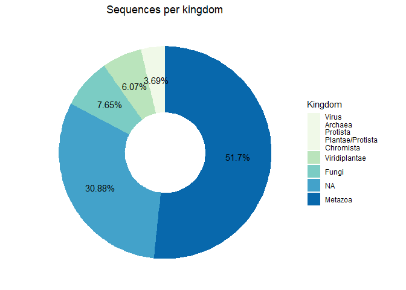
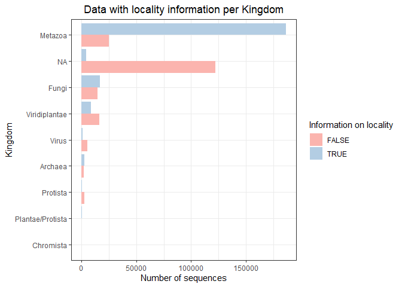
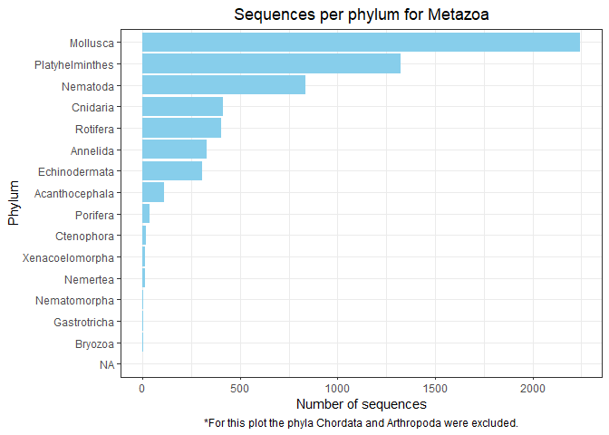
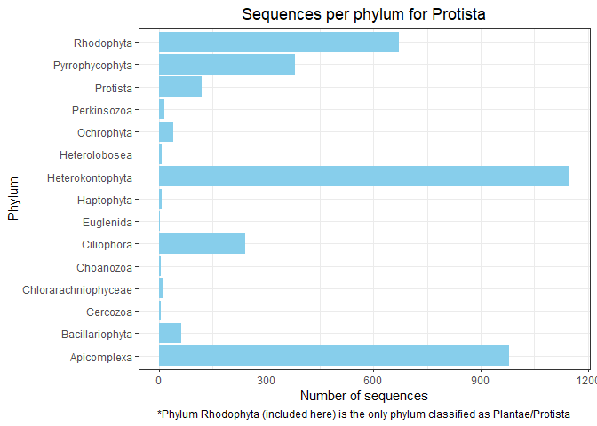

EDA GENBANK DATA
================

Number of sequences per kingdom:

    ##            kingdom    n()
    ## 1          Archaea   4883
    ## 2        Chromista      3
    ## 3            Fungi  31294
    ## 4          Metazoa 211438
    ## 5 Plantae/Protista    670
    ## 6         Protista   3365
    ## 7    Viridiplantae  24910
    ## 8            Virus   6533
    ## 9             <NA> 125994

<!-- --><!-- -->

Information available for latitude and longitude:

    ## # A tibble: 18 x 3
    ## # Groups:   kingdom [9]
    ##    kingdom          latlon_info num_seqs
    ##    <chr>            <lgl>          <int>
    ##  1 Archaea          FALSE           2929
    ##  2 Archaea          TRUE            1954
    ##  3 Chromista        FALSE              3
    ##  4 Chromista        TRUE               0
    ##  5 Fungi            FALSE          27153
    ##  6 Fungi            TRUE            4141
    ##  7 Metazoa          FALSE         194727
    ##  8 Metazoa          TRUE           16711
    ##  9 Plantae/Protista FALSE            553
    ## 10 Plantae/Protista TRUE             117
    ## 11 Protista         FALSE           2571
    ## 12 Protista         TRUE             794
    ## 13 Viridiplantae    FALSE          22668
    ## 14 Viridiplantae    TRUE            2242
    ## 15 Virus            FALSE           6456
    ## 16 Virus            TRUE              77
    ## 17 <NA>             FALSE          11520
    ## 18 <NA>             TRUE          114474

<!-- -->

<!-- -->

Information available for locality:

    ## # A tibble: 18 x 3
    ## # Groups:   kingdom [9]
    ##    kingdom          locality_info num_seqs
    ##    <chr>            <lgl>            <int>
    ##  1 Archaea          FALSE             3500
    ##  2 Archaea          TRUE              1383
    ##  3 Chromista        FALSE                3
    ##  4 Chromista        TRUE                 0
    ##  5 Fungi            FALSE            27731
    ##  6 Fungi            TRUE              3563
    ##  7 Metazoa          FALSE           138549
    ##  8 Metazoa          TRUE             72889
    ##  9 Plantae/Protista FALSE              172
    ## 10 Plantae/Protista TRUE               498
    ## 11 Protista         FALSE             3019
    ## 12 Protista         TRUE               346
    ## 13 Viridiplantae    FALSE            21218
    ## 14 Viridiplantae    TRUE              3692
    ## 15 Virus            FALSE             6378
    ## 16 Virus            TRUE               155
    ## 17 <NA>             FALSE           124224
    ## 18 <NA>             TRUE              1770

<!-- -->

<!-- -->

Sequences from kingdom Metazoa

    ## # A tibble: 18 x 2
    ## # Groups:   phylum [18]
    ##    phylum          num_seqs
    ##    <chr>              <int>
    ##  1 Arthropoda        172338
    ##  2 Chordata           33054
    ##  3 Mollusca            2244
    ##  4 Platyhelminthes     1322
    ##  5 Nematoda             834
    ##  6 Cnidaria             411
    ##  7 Rotifera             404
    ##  8 Annelida             327
    ##  9 Echinodermata        307
    ## 10 Acanthocephala       111
    ## 11 Porifera              36
    ## 12 Ctenophora            16
    ## 13 Xenacoelomorpha       14
    ## 14 Nemertea              11
    ## 15 Gastrotricha           3
    ## 16 Nematomorpha           3
    ## 17 Bryozoa                2
    ## 18 NA                     1

<!-- -->

<!-- -->

Sequences from kingdom Viridiplantae

    ## # A tibble: 9 x 2
    ## # Groups:   phylum [9]
    ##   phylum           num_seqs
    ##   <chr>               <int>
    ## 1 Magnoliophyta       20737
    ## 2 Pinophyta            2176
    ## 3 Pteridophyta          655
    ## 4 Streptophyta          533
    ## 5 Chlorophyta           287
    ## 6 Marchantiophyta       191
    ## 7 Bryophyta             147
    ## 8 Cycadophyta           144
    ## 9 Anthocerotophyta       40

<!-- -->

<!-- -->

    ## # A tibble: 12 x 2
    ## # Groups:   phylum [12]
    ##    phylum             num_seqs
    ##    <chr>                 <int>
    ##  1 Ascomycota            22980
    ##  2 Basidiomycota          5975
    ##  3 Glomeromycotina        1945
    ##  4 NA                      223
    ##  5 Zygomycota              100
    ##  6 Mucoromycota             43
    ##  7 Chytridiomycota           8
    ##  8 Microsporidia             7
    ##  9 Blastocladiomycota        5
    ## 10 Cryptomycota              4
    ## 11 Olpidiomycota             3
    ## 12 Zoopagomycota             1

``` r
phyl_fungi
```

<!-- -->

``` r
phyl_fungi2
```

<!-- -->

Sequences from kingdom Archaea

    ## # A tibble: 5 x 3
    ## # Groups:   phylum [5]
    ##   phylum                    kingdom num_seqs
    ##   <chr>                     <chr>      <int>
    ## 1 Crenarchaeota             Archaea     2350
    ## 2 Euryarchaeota             Archaea     1793
    ## 3 Candidatus Bathyarchaeota Archaea      576
    ## 4 Thaumarchaeota            Archaea      158
    ## 5 Candidatus Micrarchaeota  Archaea        6

<!-- -->

Sequences from kingdom Protista

    ## # A tibble: 16 x 3
    ## # Groups:   phylum [16]
    ##    phylum               kingdom          num_seqs
    ##    <chr>                <chr>               <int>
    ##  1 Heterokontophyta     Protista             1148
    ##  2 Apicomplexa          Protista              979
    ##  3 Rhodophyta           Plantae/Protista      670
    ##  4 Ochrophyta           Protista              387
    ##  5 Pyrrophycophyta      Protista              380
    ##  6 Ciliophora           Protista              242
    ##  7 Protista             Protista              119
    ##  8 Bacillariophyta      Protista               62
    ##  9 Perkinsozoa          Protista               14
    ## 10 Chlorarachniophyceae Protista               12
    ## 11 Haptophyta           Protista                6
    ## 12 Heterolobosea        Protista                6
    ## 13 Cercozoa             Protista                4
    ## 14 Choanozoa            Protista                4
    ## 15 Euglenida            Protista                1
    ## 16 Heterokonta          Protista                1

<!-- -->

    ## # A tibble: 2 x 3
    ## # Groups:   phylum [2]
    ##   phylum          kingdom num_seqs
    ##   <chr>           <chr>      <int>
    ## 1 Negarnaviricota Virus       5692
    ## 2 Virus           Virus        841

Sequences from kingdom Virus
<!-- -->
